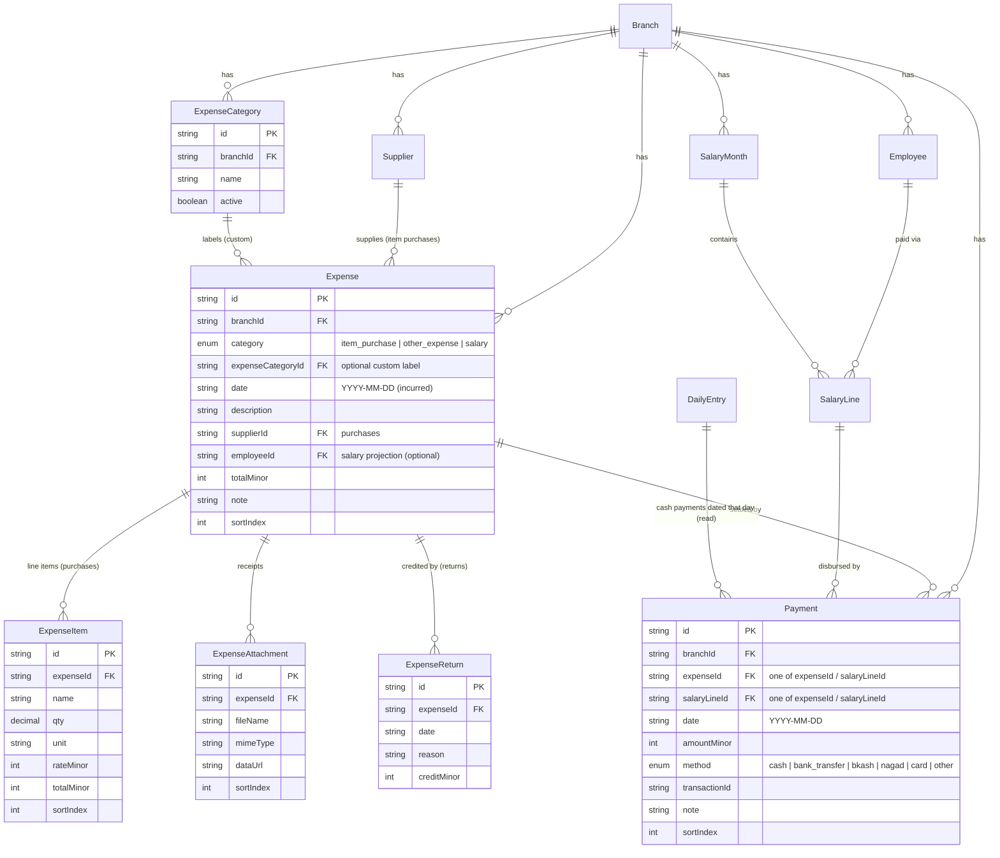

# Expense Payables Model — Plan & ERD

Status: **PROPOSAL for review. No code yet.** This is the shape we agreed to
review before committing. It builds directly on the relational cutover already
done (see `CONTEXT.md`).

## 1. Goal

Move expenses from **cash-basis** (money is only recorded when it moves, inside a
daily entry) to **accrual / payables** (an expense is *incurred* at a total, then
*paid down* over time, leaving a *due* balance), with:

- Paid / Due / Status on every expense.
- Payments carrying **method** (cash / bank / bKash / …) and **transaction id**.
- A unified **Expense Summary Dashboard** (by category, month, date) — the
  `RMS Test.pdf` views.

## 2. Locked decisions

1. Expenses become **standalone payables** with Paid/Due/Status.
2. We move toward **replacing** the daily-entry expense-line flow (daily entry
   stays as the sales + cash register).
3. Salary keeps its rich breakdown (`SalaryLine`); its payments route through the
   **one shared `Payment` table**.
4. A one-tap **Quick Expense** creates an expense + a cash payment in a single
   step, so daily use stays as fast as today.

## 3. Core idea in one line

> Every payable is either an **Expense** (item purchase / other expense) or a
> **SalaryLine** (salary). A single **Payment** table settles either one, over
> time, by method. Paid / Due / Status are always **derived**, never stored.

## 4. Target ERD

Derived (computed in queries, never stored):

- `paidMinor` = Σ payments − Σ returns credits
- `dueMinor`  = `totalMinor` − `paidMinor`
- `status`    = `unpaid` (paid = 0) · `partially_paid` (0 < paid < total) · `paid` (paid ≥ total)

## 5. How existing tables map

| Existing table | Fate | Notes |
|---|---|---|
| `Supplier` | **keep** | referenced by item-purchase expenses |
| `Employee`, `SalaryMonth`, `SalaryLine` | **keep** | salary payable + breakdown unchanged |
| `PurchaseOrder` | **replace** → `Expense (item_purchase)` | migrate then deprecate |
| `PurchaseOrderItem` | **rename/replace** → `ExpenseItem` | |
| `PurchaseReturn` / `ReturnLine` | **fold** → `ExpenseReturn` (credit against an expense) | |
| `LedgerEntry` (invoice) | **map** → `Expense` | a bill is a payable |
| `LedgerEntry` (payment) | **map** → `Payment` | |
| `LedgerEntry` (return_credit / adjustment) | **map** → `ExpenseReturn` / adjustment | |
| `LedgerEntryItem` | → `ExpenseItem` | |
| `LedgerEntryAttachment` | **rename** → `ExpenseAttachment` | |
| `SalaryPayment` | **merge** → `Payment` (+ method, + transactionId) | |
| `DailyEntryExpenseLine` | **split** → an `Expense` (if new) + a `Payment` | see §7 |
| `DailyEntryExpenseItem` | → `ExpenseItem` on the created expense | |
| `DailyEntry` (sales fields) | **keep** | becomes the cash + sales register |

New enums: `ExpenseCategory` (system), `PaymentMethod`.

## 6. Daily entry after the change

The daily entry keeps: opening balance, all sales channels, void sale,
withdrawals. It **stops** holding raw expense lines. Instead:

- **Expenses for a day** = Σ `Payment.amountMinor` dated that day.
- **Closing balance** = the existing formula, unchanged.

**Decision (reviewed against real data):** the daily balance subtracts **all**
payments regardless of method — exactly as the system does today — so no
historical closing balance ever changes. Payment `method` is informational: it
powers the dashboard and audit trail (and the disbursement log), not the balance
math. (Real methods already exist in the data — parsed from the cashbook payment
memo — so we import them faithfully rather than guessing.)

## 7. Migration & backfill (additive, non-destructive)

1. **Create** all new tables/enums. Drop nothing.
   (Done: migration `20260718002000_expense_payables_model`.)
2. **Backfill** — `scripts/backfill-expenses.mjs` (idempotent; clears + re-derives
   per branch). Mapping confirmed against the real data:
   - `PurchaseOrder` → `Expense (item_purchase)` + `ExpenseItem` (the **bill**).
     One expense per PO. `purchase` daily lines are ignored (the PO is canonical).
   - `regular` daily line → `Expense (other_expense)` + a `Payment`.
   - `vendor` daily line → `Payment` against the matching purchase `Expense`
     (paired within the day by supplier + amount; supplier-level fallback).
   - `staff` daily line → `Payment` against the `SalaryLine`. The line's
     `salaryPaymentId` is a soft link (~40% hit), so unresolved ones fall back to
     employee + month; last resort lands as an `other_expense` to keep parity.
   - **Method + transactionId** come from the linked cashbook payment entry
     (memo → method, ref → transactionId). Salary defaults to `cash`.
   - Every payment is dated on its daily-entry date, so Σ payments per day equals
     the old `expenses` figure by construction.
3. **Verify parity** — `scripts/verify-expenses.mjs` (hard gate, all passing):
   - item-purchase totals == Σ `PurchaseOrder`; Σ payments == Σ cash lines;
     salary payment total matches; no orphan targets.
   - **Daily money gate: for every daily entry, Σ Payment dated that day ==
     `DailyEntry.expenses`.** 0 mismatched days.

## 8. Backend plan

- New modules: `expenses` (CRUD + line items + attachments + returns),
  `payments` (create/list, method + txn id), `expense-categories` (the paused
  feature, per-branch custom labels), `expense-reports` (dashboard rollups).
- Paid / Due / Status computed in queries (Σ payments) — no stored duplicates.
- Daily-entry service: derive the day's expense figure from cash payments; keep
  sales writes. Remaining-balance calc updated to the §6 rule.
- Transitional compatibility: keep old read endpoints returning equivalent shapes
  until the frontend is cut over, then remove.

## 9. Frontend plan (the bulk of the work)

- **Expenses screen** — list with Date / Description / Category / Total / Paid /
  Due / Status; filters by category + month; matches the PDF tables.
- **Expense detail** — payment history + "Add payment" (amount, method,
  transaction id, date).
- **Quick Expense** — one dialog that creates the expense + a cash payment in a
  single step (keeps daily speed).
- **Salary** — add method + transaction id to the payment entry; surface
  Paid / Due / Status (mostly already computable).
- **Dashboard** — KPI strip (Total / Paid / Due) + rollups by category, month,
  date (the `RMS Test.pdf` dashboard).
- **Daily entry** — remove expense-line entry; show a read-only "cash paid today"
  summary; keep all sales inputs.

## 10. Reports

- **Expense summary**: group `Expense` (+ salary via `SalaryLine`) by category /
  month / date with Total / Paid / Due.
- **Salary disbursement log**: `Payment` where `salaryLineId` is set, with method
  + transaction id.

## 11. Production rollout (same proven recipe as the last cutover)

1. Back up production DB.
2. Apply additive migrations (nothing dropped).
3. Run the idempotent backfill.
4. Run parity verification incl. the historical-cash-balance check.
5. Deploy backend (compatibility mode).
6. Cut the frontend over.
7. Safety window (~1 week) with old tables kept as a live fallback.
8. Only then: deprecate/drop old tables & columns.

**Production data is never harmed:** every step is additive and reversible until
the drop, which happens only after the model is proven on real data.

## 12. Risks & mitigations

| Risk | Mitigation |
|---|---|
| Cash math changes silently break closing balances | Hard parity gate: recompute every historical daily entry's closing cash and require an exact match |
| Heavier daily UX | Quick Expense one-tap fast path |
| Payment method unknown for historical data | Cash for anything that previously hit the drawer; `other` for payroll-only payments (never touched a drawer) |
| Returns / credits modeling | `ExpenseReturn` credit reduces paid/due explicitly |
| Unlinked / ambiguous old data | Backfill is best-effort with a report of anything that couldn't be matched; nothing is dropped |

## 13. Phased milestones

- **P1** Schema + additive migration (local).
- **P2** Backfill + parity verify, incl. daily-cash reconciliation (local).
- **P3** Backend: expenses, payments, categories, reports (with compatibility).
- **P4** Frontend: expenses, payments, Quick Expense, dashboard, salary
  method/txn, daily-entry change.
- **P5** Production rollout (§11).
- **P6** Cleanup: drop deprecated tables/columns after the safety window.
